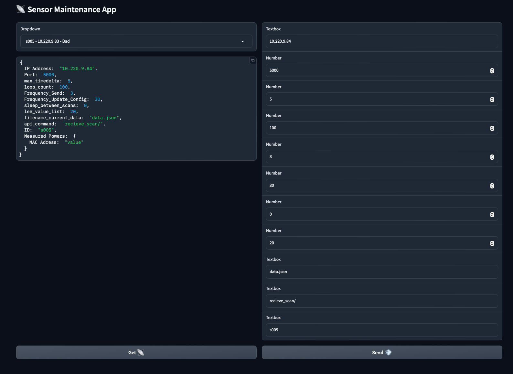

# BLE_Sensor
BLE Sensor for Indoor Positioning

This Repository has all necessary Files needed to set up a BLE Sensor and is Part of the Bigger Project [Indoor Positioning](https://github.com/j-tobias/Indoor-Positioning)

This Sensor continouisly scans for iBeacons and tracks their RSSI values
In a given Frequenz it uploads these Results to a given Server via an POST API command

Each Sensor Provides an API to allow for different settings of parameters

## Mainetenance APP
I added an app to easily change the settings of the Sensors

